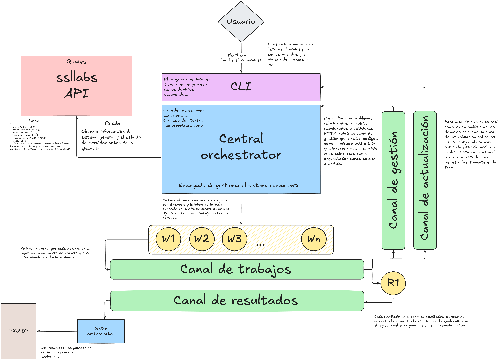

# TLSCTL - SSL/TLS Assessment CLI

TLSCTL es una herramienta de línea de comandos diseñada para el análisis de seguridad SSL/TLS mediante la API de Qualys SSL Labs. Su objetivo es automatizar la evaluación de múltiples dominios de forma eficiente, centralizando la gestión de resultados y logs.

## Características principales

El funcionamiento de `tlsctl` se fundamenta en un modelo de concurrencia gestionado. Utiliza un patrón de **Worker Pool** que permite la reutilización de procesos para procesar flujos extensos de dominios sin saturar los recursos del sistema ni los límites de la API externa.

* **Gestión de Polling:** El sistema integra una lógica de espera activa que se ajusta a las recomendaciones de la API (intervalos de 5 y 10 segundos), asegurando la obtención de resultados sin incurrir en peticiones innecesarias.
* **Comunicación por Canales:** Emplea una arquitectura de canales segmentados para la distribución de tareas, recolección de resultados, señales de estado del servidor y actualizaciones de progreso en tiempo real.
* **Persistencia y Auditoría:** Los resultados finales se exportan en formato JSON dentro de una carpeta dedicada para facilitar su posterior análisis. El sistema de logs se centraliza en un archivo `scan.log` utilizando la librería estándar `slog`.

## Arquitectura del sistema

La arquitectura de la aplicación se articula en torno a un **orquestador central**. Este componente es responsable de coordinar el ciclo de vida completo de la ejecución, desde la inicialización de canales hasta el cierre controlado de los workers.

Al iniciar, el orquestador realiza una consulta previa al endpoint `info` de la API para determinar las capacidades actuales del servidor. Basándose en esta información y en los parámetros definidos por el usuario, se despliega el pool de workers. El flujo de datos se divide en cuatro canales principales:

1. **Canal de Trabajos (Jobs):** Donde se depositan los dominios a procesar.
2. **Canal de Resultados (Results):** Donde se recolectan las estructuras `ScanTask` una vez finalizadas.
3. **Canal de Señales (Signals):** Utilizado para que los workers notifiquen errores críticos de infraestructura (como los estados HTTP 503 o 529), permitiendo al orquestador abortar la ejecución si el servicio no está disponible.
4. **Canal de Actualización (Progress):** Una vía dedicada para transmitir el estado intermedio de los endpoints hacia una goroutine encargada de la visualización en la terminal.

Este diseño permite que la lógica de red permanezca separada de la lógica de presentación, garantizando que el monitoreo sea fluido y no interfiera con el rendimiento de los escaneos.



Puede observar la imagen con mas detalle en el siguiente [enlace](https://drive.google.com/file/d/1-39qpvX4wpNwAJshdjCkACeJO9n5s-4y/view?usp=sharing)

## Decisiones de diseño

* **Limitación de Concurrencia:** A pesar de que la API puede informar una capacidad técnica mayor, se ha restringido el número de workers a un rango de 1 a 5. Esta decisión responde estrictamente a las políticas de uso de SSL Labs, que solicitan mantener el número de evaluaciones concurrentes al mínimo para evitar bloqueos de red o degradación del servicio.
* **Modularidad del Worker:** El worker asume la responsabilidad de gestionar el ciclo de polling de cada dominio. Se optó por este enfoque para permitir que el canal de actualizaciones envíe información detallada de los endpoints de manera asíncrona, manteniendo la independencia de la lógica de red.
* **Gestión de Salida y Logs:** Para evitar que la concurrencia de mensajes de log corrompa la legibilidad de la tabla de progreso en la terminal, se ha redirigido toda la actividad del sistema al archivo `scan.log`. De este modo, el usuario recibe una salida estática y limpia en `stdout`, mientras que el detalle técnico permanece disponible para auditoría en el archivo de registro.

## Estructura del proyecto

```text
.
├── flake.lock
├── flake.nix
├── go.mod
├── internal
│   ├── project
│   │   └── root.go            # Utilidad para localización del proyecto
│   └── scan
│       ├── client.go          # Implementación de lógica de red
│       ├── constants.go       # Definiciones globales y constantes
│       ├── info.go            # Gestión del endpoint de información de la API
│       ├── orchestrator.go    # Coordinación de workers y canales
│       ├── save.go            # Persistencia de resultados a JSON
│       ├── task.go            # Definición de estructuras de datos (DTOs)
│       └── validate_domains.go # Filtro y validación de entrada de usuario
├── main.go                    # Punto de entrada y gestión de banderas (flags)
├── README.md
├── results/                   # Directorio de salida para archivos JSON

```

## Instalación y uso

Para compilar y ejecutar la herramienta, es necesario contar con el entorno de Go instalado:

```bash
# Clonar el repositorio
git clone <repositorio>

# Compilar el binario
go build -o tlsctl

# Ejecutar un escaneo con un número específico de workers
./tlsctl scan -w 2 google.com ssllabs.com

```

**Banderas disponibles:**

* `-w`: Define el número de workers concurrentes (Mínimo: 1, Máximo: 5). Por defecto es 5 si no se especifica.